

# 올리브영 AIOps 기반 운영 분석

**MSA 기반 올리브영을 구현하여, 장애 알람이 발생했을 때 담당자가 메트릭 · 로그 · 트레이스 · 
EKS 상태를 일일이 확인하지 않아도 Agent가 먼저 조사해 장애 리포트를 작성해줍니다.**

  
  
  
  
  
  
  
  

**CJ AI-Cloudwave 1기 5팀** &nbsp;·&nbsp; 2026.08.07 ~ 2026.08.28

---

## 프로젝트 개요

### 선정 배경 — 알림 피로는 업계 공통 문제

| 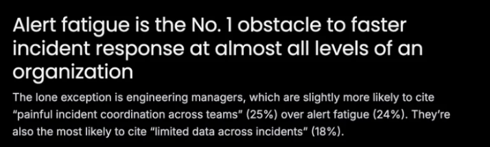 | 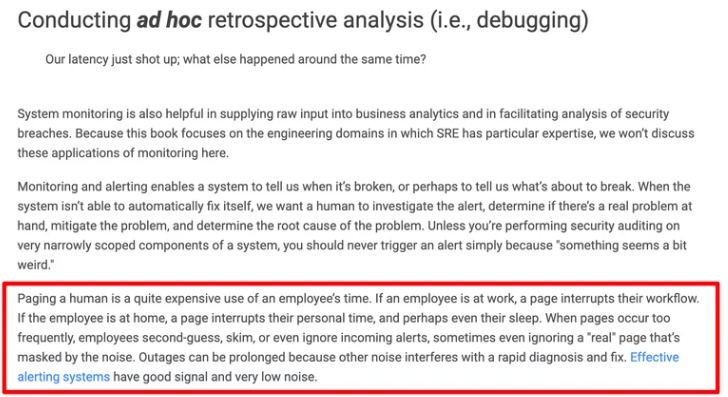 |
|:---:|:---:|
| [**Grafana Labs** — Observability Survey 2025](https://grafana.com/observability-survey-2025/) | [**Google** — SRE Book, Ch.6](https://sre.google/sre-book/monitoring-distributed-systems/) |
| 조직의 **거의 모든 직급**에서 알림 피로가 Incident 대응을 늦추는 **1순위 장애물** | 알림이 잦으면 결국 **무시**하게 되고, **노이즈에 가려진 진짜 장애까지 놓친다** |

위 사례와 같이 업계에서는 **자주 반복되는 장애 알람으로 담당자의 피로도가 증가**합니다. 또한
알람이 너무 많아 **진짜 장애를 찾기가 어려워지고**, 찾아야 할 메트릭 · 로그 · 트레이스 · AWS
리소스 등의 정보를 별도로 확인하다 보니 **장애 파악 시간이 증가**하게 됩니다. 흩어진 정보를
모아 **문제의 원인을 찾고 어떤 조치를 해야 할지 판단하기까지도 오랜 시간이 걸립니다.** 야간이나 주말
시간대에는 대응이 빠르게 진행되지 못해, 수동 분석에 의존하는 구조에서는 문제가 더 크게
발생합니다. 따라서 이러한 문제를 해결하기 위해 **AI Agent를 이용해 장애 발생 시 담당자가
빠른 시간 내에 조치할 수 있도록 돕고, 탐지 시간과 복구 시간을 줄이는 것**을 목표로 합니다.

### 목표

**MSA 아키텍처로 올리브영 서비스를 구현하고, 그 위에서 동작하는 AI Agent를 만들어 장애
발생 시 운영 처리가 효율적으로 이루어지도록 하는 것**이 이 프로젝트의 목표입니다. 이를 위해
아래 네 가지를 세부 목표로 두었습니다.

- **MTTD · MTTR 단축** — 장애를 알아채기까지 걸리는 시간(MTTD, Mean Time To Detect)과
  알아챈 뒤 복구까지 걸리는 시간(MTTR, Mean Time To Recover)을 줄입니다
- **장애 판정의 검증** — 발생한 장애 알림(Incident)이 **실제 장애인지, 정상 변동을 잘못
  판정한 것은 아닌지** 리포트를 내보내기 전에 검증합니다
- **원인과 조치 방안 제공** — 담당자에게 **문제의 원인 · 판정 근거 · 조치 방안**을 리포트로 함께 전달합니다
- **Runbook 자동 확장** — **새로운 유형의 Incident가 발생하면 Runbook을 갱신**할 수 있는 Agent를 둡니다

---

## 팀 구성원

|  |  |  |  |  |
|:---:|:---:|:---:|:---:|:---:|
| **백종훈** | **이호근** | **최혜원** | **백세연** | **이승준** |
| INFRA | DATA | OPS | DEVOPS | AI |
| [@jonghun1204](https://github.com/jonghun1204) | [@2ghrms](https://github.com/2ghrms) | [@hyewonchoi](https://github.com/hyewonchoi) | [@seyeon-baek](https://github.com/seyeon-baek) | [@LEEJUUUN](https://github.com/LEEJUUUN) |

---

## 사용 스택

| 영역 | 사용 기술 |
|---|---|
| **Frontend** | React 18 · TypeScript · Vite |
| **Backend** | Java 17 · Spring Boot · Spring Batch · gRPC · Resilience4j |
| **Data** | Aurora PostgreSQL Serverless v2 · ElastiCache Redis · DynamoDB |
| **Messaging** | Amazon MSK · MSK Connect(Debezium CDC) · SQS FIFO · Outbox |
| **Infra** | Amazon EKS · Karpenter · HPA · Terraform · ArgoCD · ECR |
| **Observability** | Prometheus · Thanos · Loki · Tempo · Grafana · OTel · CloudWatch |
| **AI Agent** | Amazon Bedrock · AgentCore · Strands Agents · MCP |
| **Test** | k6 · nGrinder · 카오스 주입 · ground truth 라벨링 |

---

## 웹 프론트엔드 구현

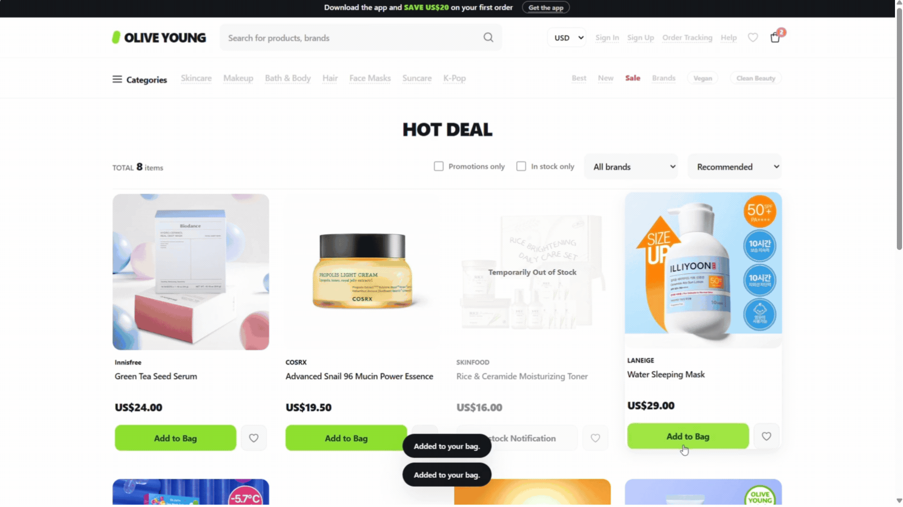

---

## 전체 아키텍처

대규모 세일 트래픽을 받는 **MSA 5종** 위에 **관측 → 탐지 → Agent** 파이프라인을 올렸습니다.

### 1. MSA 서비스

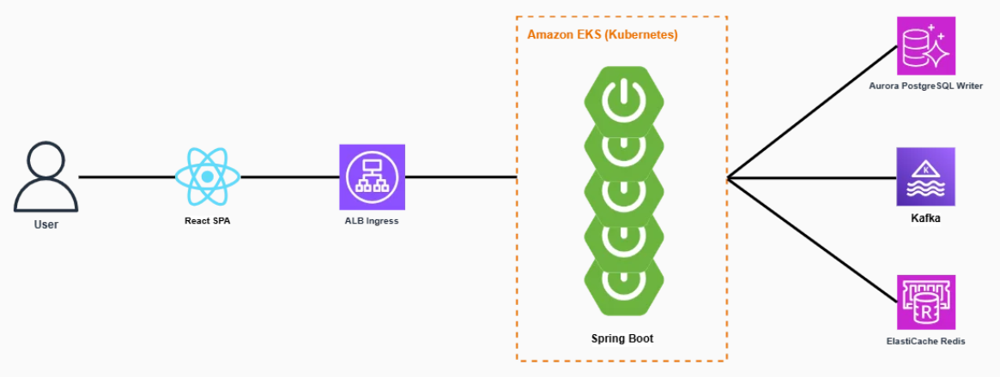

- 서비스는 **Order**(Saga 오케스트레이터 + Outbox) · **Inventory**(재고 예약/확정, Redis Lua) ·
  **Payment**(Mock PG, **유일한 장애 주입 지점**) · **Settlement**(정산 배치) ·
  **Notification**(SSE) 5종으로 구성했습니다
- 주문 내부 호출은 **gRPC**로, 확정 이벤트는 **Outbox + Debezium CDC**를 거쳐 MSK로 전파합니다
- Order에 **TimeLimiter 2s + CircuitBreaker**를 걸었고, 이 두 값이 시나리오 A와 B를 가릅니다
- 재고 판정은 **Redis 카운터**가 맡고 DB는 결과만 받아 적어, 같은 행에 쓰기가 몰리는 것을 피합니다

<b>상세 아키텍처 펼치기</b>

 

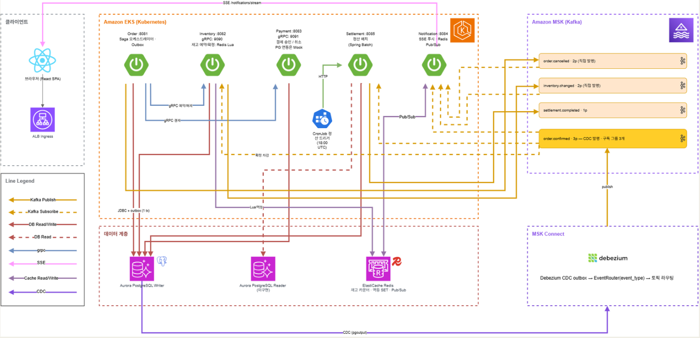

- Kafka 토픽은 `order.confirmed`(3파티션, CDC 발행, 구독 그룹 3개) · `order.cancelled` ·
  `inventory.changed` · `settlement.completed` 네 종으로 나눴습니다
- **MSK Connect(Debezium)** 가 outbox 테이블을 읽어 `EventRouter(event_type)` 로 각 토픽에
  라우팅합니다

---

### 2. 모니터링

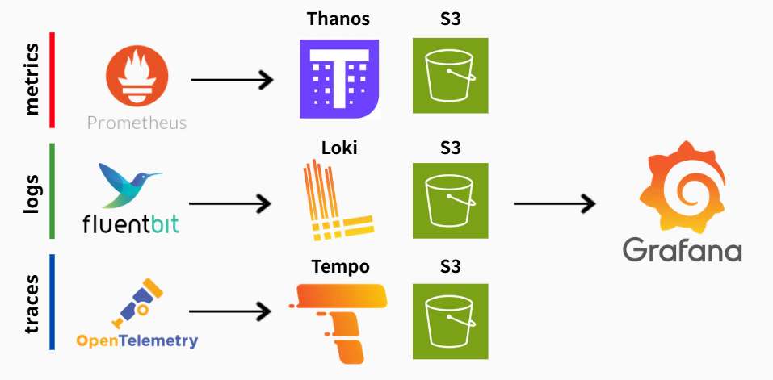

- 메트릭 · 로그 · 트레이스를 각각 **Thanos · Loki · Tempo**로 받아 **S3**에 장기 보관하고,
  조회는 **Grafana 한 곳**으로 모았습니다
- Prometheus는 **Agent 모드**로 수집만 담당합니다. 저장까지 맡기면 해당 Pod가 축출되는 순간
  관측 수단 자체가 사라지기 때문입니다
- `feat:*` **레코딩 룰 50종**을 단일 피처 정의로 삼아, 탐지 규칙과 대시보드가 같은 값을 봅니다
- 노드를 **시스템 / 워커 2계층**으로 분리해, 워크로드가 스케일될 때 관측 스택이 함께 밀려나지
  않도록 했습니다

---

### 3. Incident 탐지

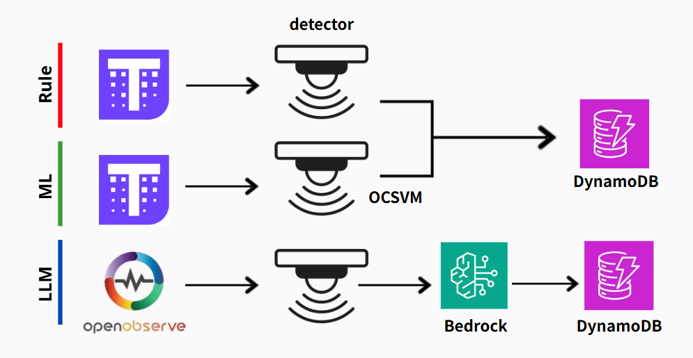

- **규칙 트랙** — `rule-detector`가 CronJob으로 1분마다 `feat:*` 피처를 읽어 판정합니다
- **ML 트랙** — **One-Class SVM**을 씁니다. 오탐률 2% 고정 기준으로 비교했을 때
  Isolation Forest는 12.7% / 8.7%, OCSVM은 **5.0% / 6.1%** 로 더 안정적이었습니다
- **LLM 트랙** — 비교 실험용 RCA 트랙으로, 탐지는 하지 않고 Bedrock으로 원인만 추론합니다
- 세 트랙의 결과는 **Incident 스키마 하나**로 합류해 DynamoDB에 적재됩니다

---

### 4. AI Agent

Agent는 크게 **Scout Agent**와 **Runbook Agent** 두 가지로 구분했습니다. **Scout Agent**는
Incident가 발생했을 때 지표 · 로그 · 클러스터 상태를 스스로 조사해 원인을 판정하고, 조치
방안까지 담은 리포트를 작성합니다. **Runbook Agent**는 대응 방법이 없는 새로운 유형의 장애가
발생했을 때 그 대응 절차를 Runbook으로 만들어 승인을 거쳐 저장합니다.

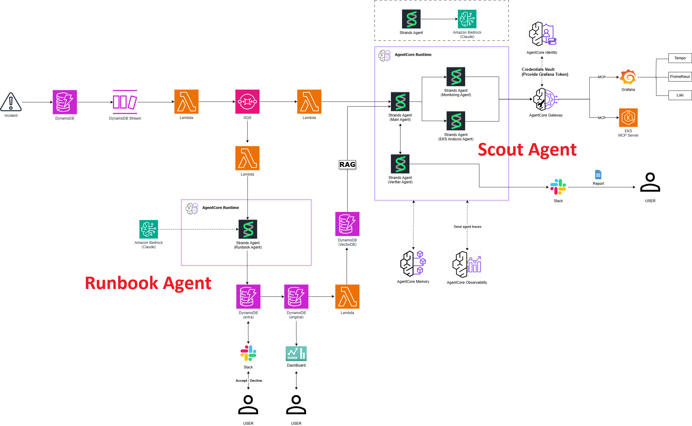

#### Scout Agent

Scout Agent는 **멀티 Agent**로 구성했습니다. **Agents as Tools** 방식이라 사람이 워크플로우를
미리 짜 둘 필요 없이, 요청에 따라 **Main Agent가 서브 Agent들을 직접 호출**하고 필요한
것만 골라 쓰면서 문제를 풀어 나갑니다.

| Agent | 역할 |
|---|---|
| **Main** | Runbook과 Incident 정보, 두 서브 Agent의 조사 결과를 바탕으로 **리포트를 작성**합니다 |
| **Monitoring** | 메트릭 · 로그 · 트레이스 정보를 조사합니다 (Grafana MCP 10종) |
| **EKS 분석** | Pod · Node · HPA · 클러스터 이벤트를 조사합니다 (EKS MCP 4종) |
| **Verifier** (검증) | Main Agent의 **리포트 초안을 검증**하고, 판정 실패 시 **재작성을 요구**합니다 |

- Incident는 `DynamoDB Stream → Lambda relay → SQS FIFO`를 거쳐 전달되므로, Agent가
  멈춰 있어도 유실되지 않습니다
- Agent에는 **읽기 권한만** 줍니다. MCP 서버를 쓰기 옵션 없이 띄우고, 클라이언트
  화이트리스트로 한 번 더 걸러 **2중으로 차단**합니다
- 조치 후보는 **RAG(임베딩 유사도)** 로 고르되, 후보 간 점수 차가 충분하지 않으면 자동 진행
  대신 **사람에게 넘깁니다**(HITL)
- Verifier는 리포트 초안을 **Incident 원본 데이터 · 서브 Agent가 수집한 증거 · Runbook의 판정
  기준**과 다시 대조합니다. 근거 없는 주장이나 Runbook에 없는 조치가 섞여 있으면 재작성을 요구합니다

#### Runbook Agent

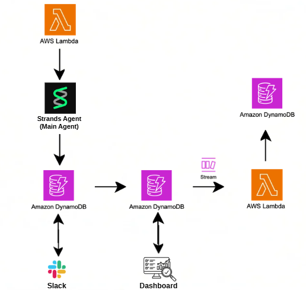

- 기존 Runbook 어디에도 매칭되지 않아 **`type: NOT_KNOWN`** 으로 기록된 Incident를 전용 큐로
  받아 Runbook Agent를 호출합니다
- 먼저 **기존 Runbook과 임베딩 유사도를 비교**합니다. 유사도가 높으면 **기존 타입을 그대로
  사용**하고, 낮으면 **새로운 타입으로 Runbook 초안을 생성**합니다
- 새로 만든 초안은 **Slack으로 담당자에게 승인을 요청**하며, 승인 전까지는 어떤 Runbook도
  실제로 사용되지 않습니다
- 담당자가 승인하면 **초안 테이블에서 원본 테이블로 승격 저장**됩니다
- 원본 테이블에 저장되면 **DynamoDB Streams**가 이를 감지해 자동으로 **임베딩**하고, 다음
  장애부터 이 Runbook이 유사도 비교 대상에 포함됩니다

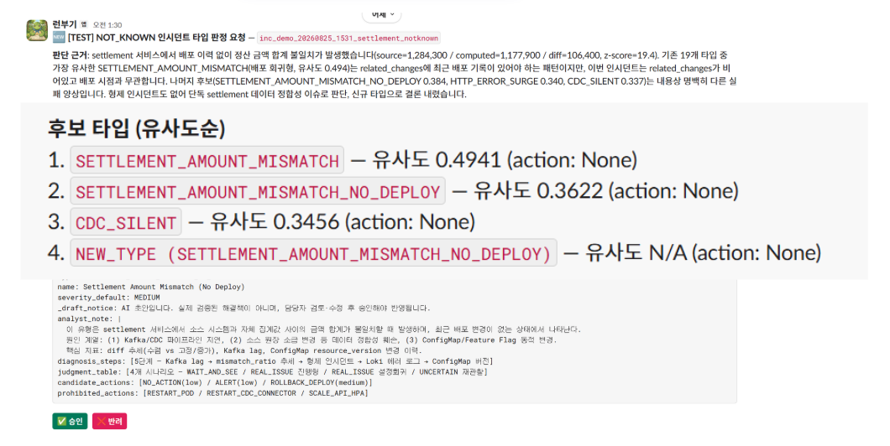

Agent가 새로운 Runbook을 만들어도 되는지 **Slack으로 담당자에게 승인을 요청한 메시지**입니다.
이렇게 승인이 쌓일수록 대응할 수 있는 장애의 범위가 넓어집니다.

---

## 부하 시나리오 A · B · C

**k6**와 **nGrinder**를 통해 부하테스트를 진행했습니다. k6로는 24시간 정상 트래픽을 만들고
그 위에 장애 시나리오 세 가지를 각각 3세트씩 주입해 정상 상태와 비교했으며, nGrinder로는
카오스 없이 정상 트래픽만 올려 **동시접속 한계**를 따로 측정했습니다. 장애 주입은
**Mock PG의 설정 API**(`POST /mock/payment/config`)와 **파드 스케일링**으로 이루어집니다.

| | 시나리오 | 어떻게 주입했는가 |
|---|---|---|
| **A** | **결제 거절형** | Mock PG의 결제 실패율을 높여 결제가 거절되게 만듭니다 |
| **B** | **PG 지연형** | Mock PG의 응답 지연을 3초로 늘려 서킷브레이커가 열리게 만듭니다 |
| **C** | **인프라 스케일링** (대조군) | 파드를 늘려 워밍업 구간을 만듭니다 |

주입한 시나리오가 지표에 어떻게 나타나는지는 **Grafana 대시보드**를 통해 확인할 수 있었습니다.

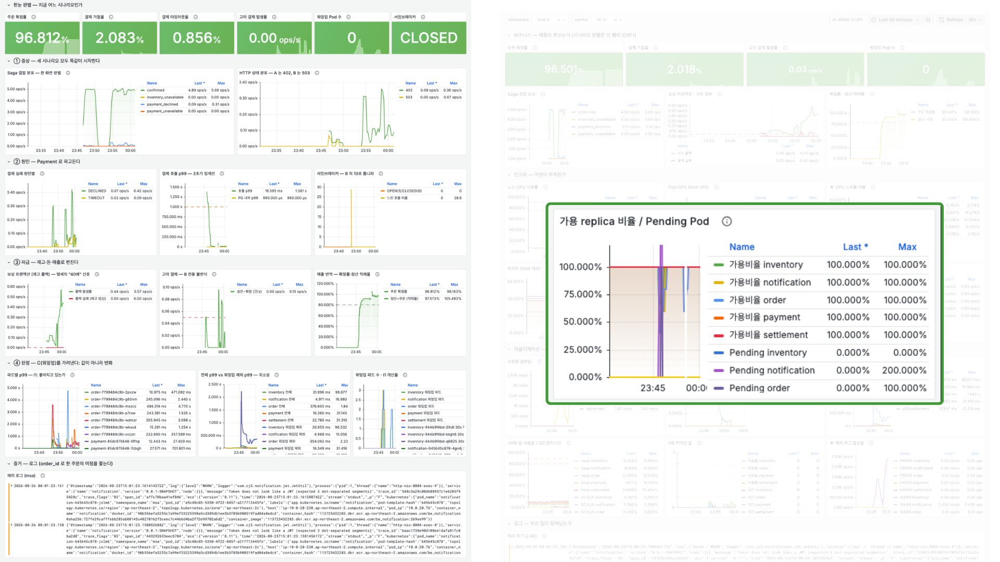

상단 스탯 6개(주문 확정률 · 결제 거절율 · 타임아웃율 · 고아 결제 · 워밍업 Pod · 서킷브레이커)만
보면 **지금 어느 시나리오인지 한눈에** 판별됩니다.

---

## 주요 기능

Runbook · Incident · Agent 실행 결과를 한 화면에서 관리하는 대시보드입니다.
`Dashboard` · `Incidents` · `Runbooks` · `Graph` · `Metrics` · `Evaluations` · `Traces`
7개 화면으로 구성했습니다.

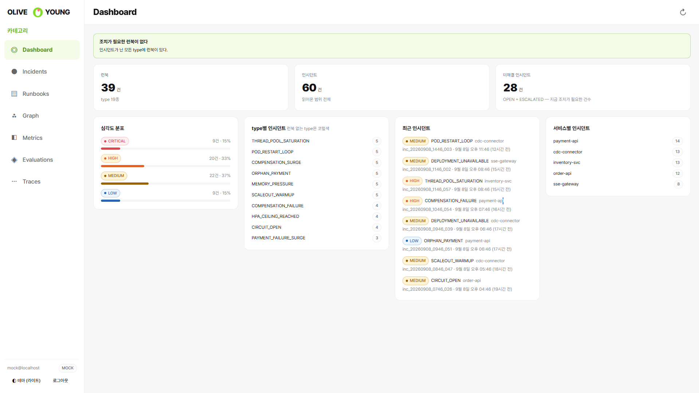

| Incident 정보 확인 | Runbook 관리 |
|:---:|:---:|
| 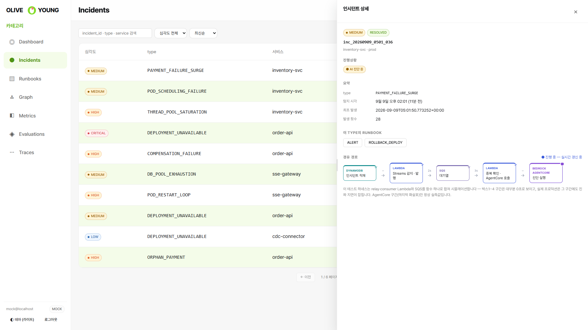 | 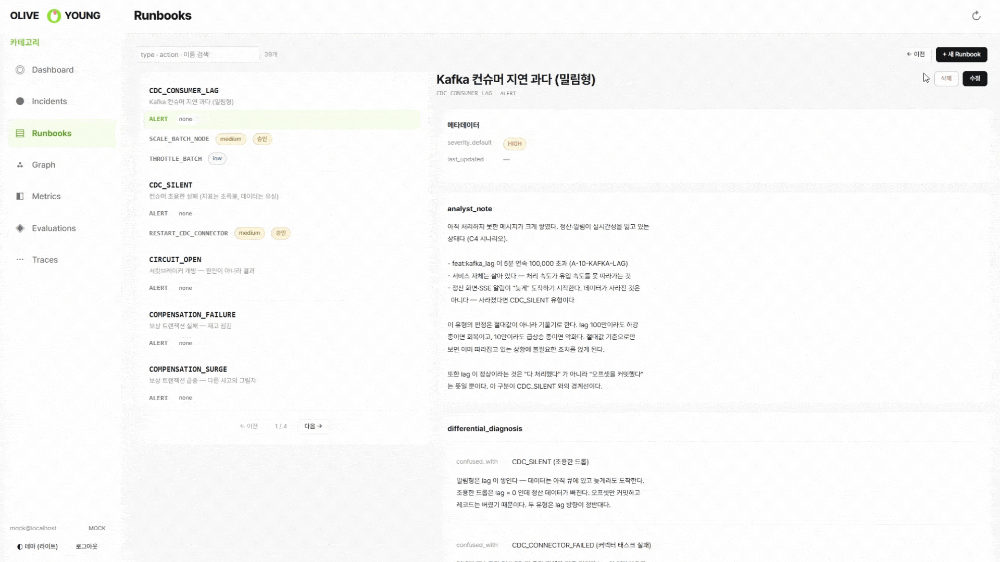 |
| 심각도 · 유형 · 서비스 · 상태별로 집계하고, Agent의 진단 경로를 실시간으로 보여줍니다 | Runbook을 조회 · 검색 · 편집 · 생성 · 삭제합니다 |

| Incident · Runbook 관계 그래프 | 운영 지표 |
|:---:|:---:|
| 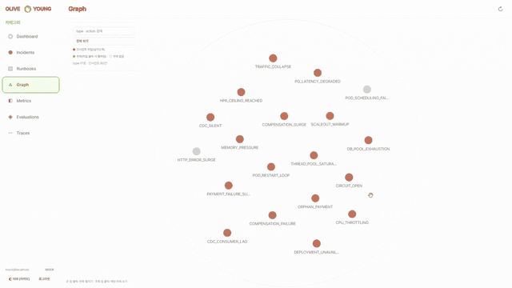 | 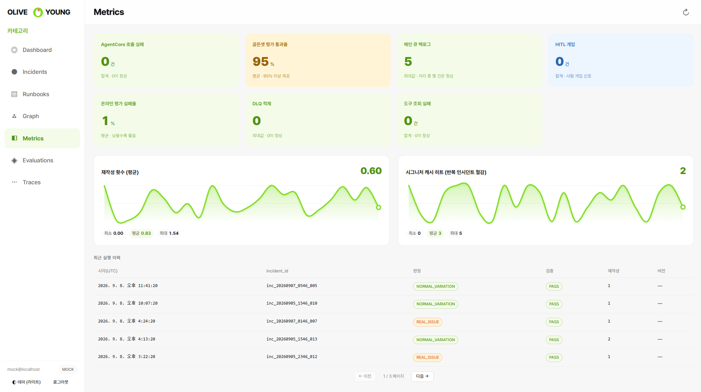 |
| Incident 유형과 Runbook의 연결을 그래프로 시각화합니다 | Agent 파이프라인 상태를 시계열로 확인합니다 |

| Agent 평가 | Agent 실행 트레이스 |
|:---:|:---:|
| 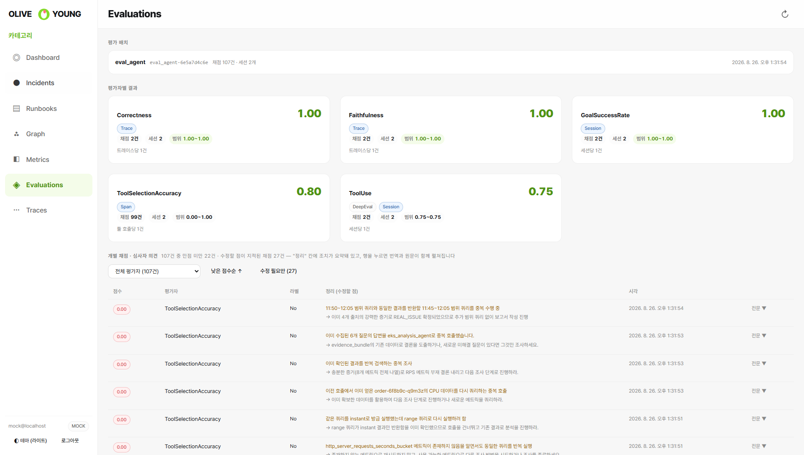 | 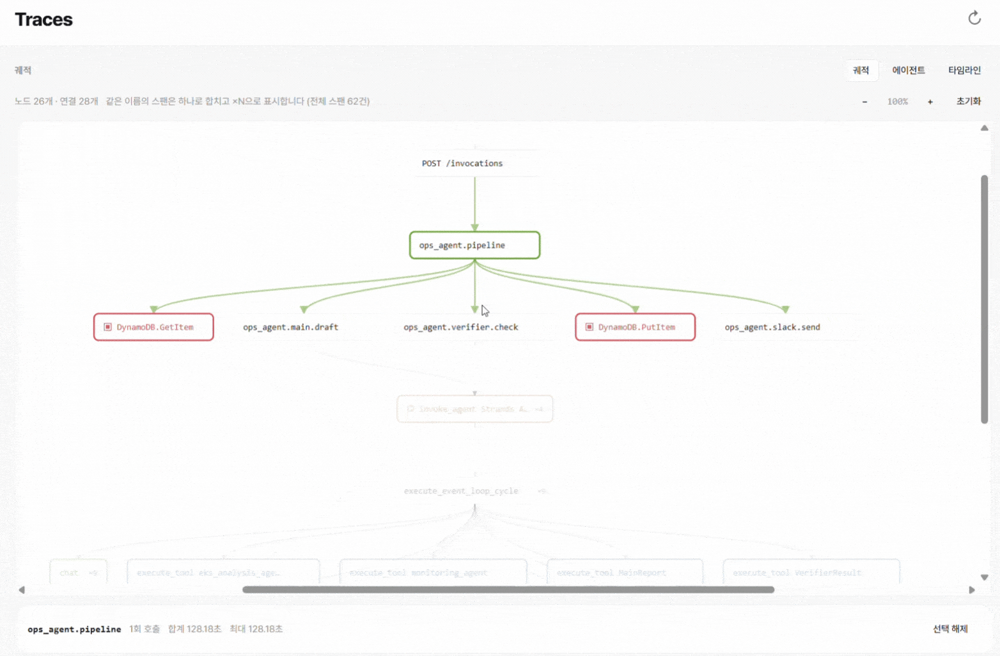 |
| Agent 평가 점수와 심사자의 의견을 번역 · 요약해 함께 표시합니다 | 스팬 세부정보와 실행 궤적, 토큰 · 오류를 확인합니다 |

---

## 실행 결과

구성한 Agent를 통해 **Incident가 발생했을 때 처리되는 과정을 대시보드에서 확인**할 수 있고,
그 결과로 **담당자에게 Slack으로 장애 리포트가 전달**됩니다.

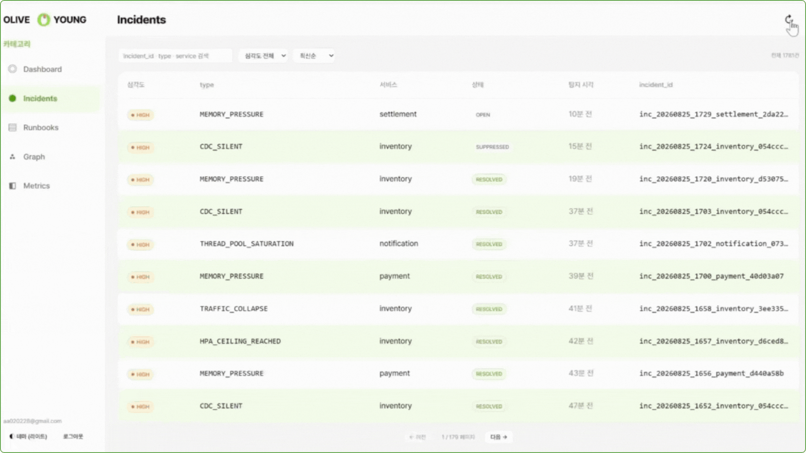

Incident가 들어와 Agent의 조사와 판정을 거치는 동안, 진단이 어디까지 진행됐는지 대시보드에
실시간으로 나타납니다.

  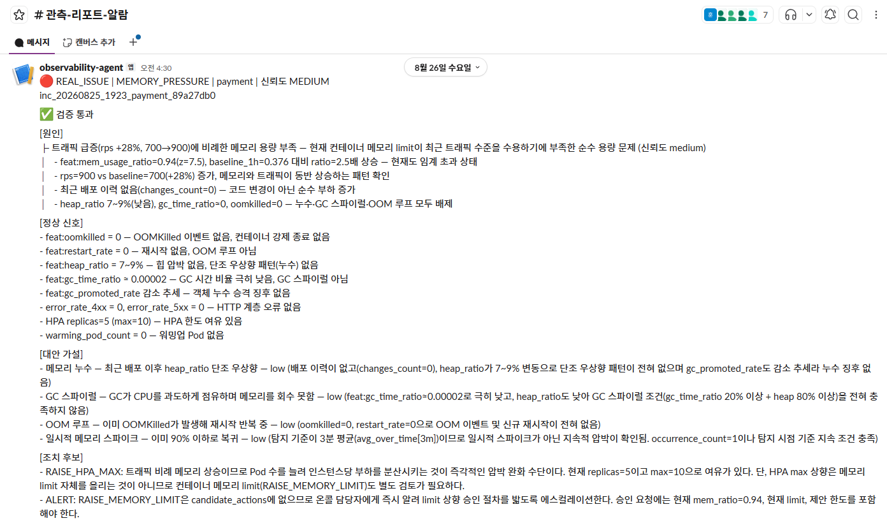

조사가 끝나면 담당자에게 Slack으로 리포트가 도착합니다. **문제의 원인 · 판정 근거 · 조치
방안**이 함께 담기며, 조치는 제안일 뿐 Agent가 직접 실행하지는 않습니다.

---

## 저장소

| 저장소 | 구성된 코드 |
|---|---|
| [`backend`](../backend) | Spring Boot MSA 5종 (order · inventory · payment · settlement · notification) |
| [`frontend`](../frontend) | React 세일 페이지 (상품 그리드 · 장바구니 · 체크아웃) |
| [`incident-detection`](../incident-detection) | 관측 스택 매니페스트 · 규칙 탐지기 · ML 탐지기 · Incident 스키마 |
| [`ai-observability-agents`](../ai-observability-agents) | Scout Agent (Main · Monitoring · EKS · Verifier) · MCP 런타임 · Runbook 19종 |
| [`ai-runbook-agents`](../ai-runbook-agents) | Runbook Agent · SQS 컨슈머 Lambda · Slack 승인 콜백 Lambda |
| [`ai-agent-dashboard`](../ai-agent-dashboard) | React 대시보드 프런트엔드 · 조회 API |
| [`load-test`](../load-test) | k6 부하 스크립트 · 카오스 스케줄러 · nGrinder 시나리오 |
| [`iac-terraform`](../iac-terraform) | Terraform 모듈 (VPC · EKS) |
| [`documentation`](../documentation) | 설계 문서 (architecture · decisions · contracts · schema) |
| [`trouble-shooting`](../trouble-shooting) | 트러블슈팅 기록 (문제 하나당 파일 하나) |

 

**CJ AI-Cloudwave 1기 5팀**

